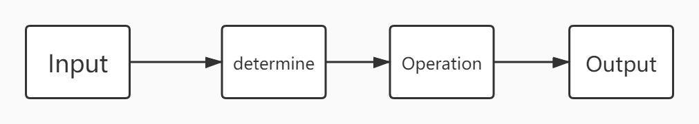
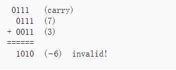
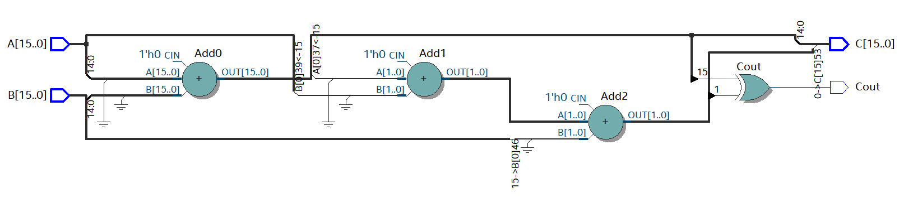
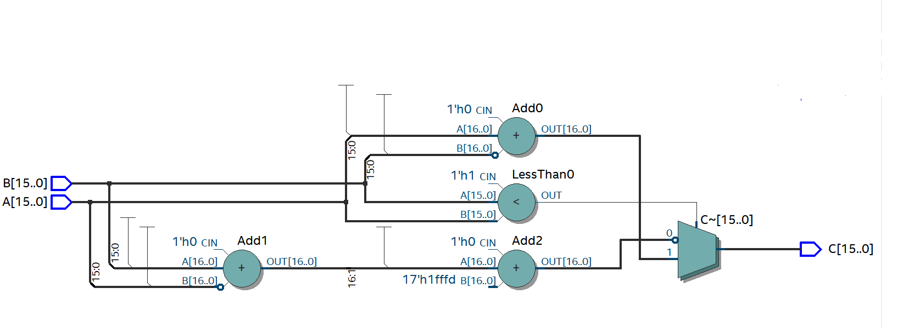
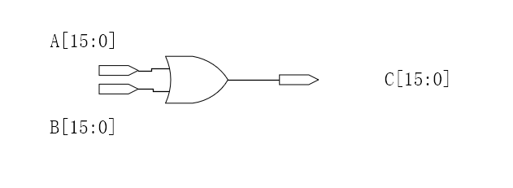
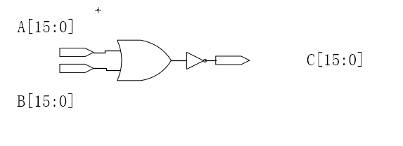

# Lab-report

## Introduction

This project required us to design a 16-bit ALU, which is based on basic logical operators and the variables.
From this project we will learn how to use the operators and variable of the Verilog HDL programming language and how to simulate it.
Such as add operator and how to deal with the overflow.

We use three 16-bit arrays to regard the two 16-bit binary input number and the output number.
The operators are use 4-bit binary number to regard.
We use case structure to realize the operators.

## Design

### Module design

For design an ALU module, we should know how the ALU work.
This project is a simple ALU system. 
Input 16-bit arrays and 4-bit operators, then inside the system the system will distinguish the operators and transport the data into related case. 
Then use different operators to calculate the data, and get the results.

we design a branch structure using OP to determine what we will do.

The whole circuit is shown as follow.

## Implementation

### Addition

We need to detected overflow.
When overflow happen, Cout must be one.
So when overflow happens?
The Wikipedia picture shows that if the two left rounds are not the same, overflow occurs.

So I designed a structure that detects the two carry on the left and XORs it.

### subtraction

This is a easy problem.
We can judge who is smaller before calculating.
The circuit picture was shown below.

### AND

For the AND operator. 
AND operator is the logical operator-> '&'.
we input A, B and the operator AND, then get the output C= A & B. Besides, the AND operator does not exist the problem that overflow, so we only need to set cout=0.  

### OR

This is a easy problem.
The picture was shown below.

### NAND

NAND operator is based on AND operator, which is inverse of the AND operator. 
Like the process of "AND" operator, we only need to add a '~' before the process that "AND" operator, so we get C=~(A&B).
It does not exist overflow.

### NOR

This is a easy problem.
The picture was shown below.

### XOR 

XOR operator is exclusive OR, which is the operator that if input are the same, then the output will be 0. 
And if the input are different, then the output will be 1.
Then we get C= A^B.
It does not exist overflow.

### XNOR

The gate works by receiving two inputs, each of which is specified as 1 or 0.If both inputs are 0, the gate will produce 1.If both inputs are 1, the gate will also produce 1.However, if one of the inputs is different from the other, the gate will output 0.

### identity

As for identity, that output is equal to its input A.
Then we get C= A. 
It does not exist overflow.

### NOT

The gate works by receiving one input. If the input is 1, the gate produce 0. If the input is 0, the gate produce 0.

### Logical shift 

logical shift operator is about let the element in Array A shift right side for 1 position, and use 0 to supplement the empty space due to displacement.
we will get C=A >> 1.
It does not exist overflow.

### Arithmetic right shift

Instead of padding all zeros like a logical translation, when moving to the right, the leftmost bit is copied to fill all empty bits.

### rotate right 

Rotate right operator is that let the last element of the arrar A to be the first element, and then other element shift right for one position. 
We will get C={A[0],A[15:1]}.
It does not exist overflow.

### Logical left shift

Simply move each bit in the operand by a given number of bit positions, then fill the empty bit positions with 0.

### Arithmetic left shift 

The Arithmetic left shift operator is to rotate the element in the array A lefthand 1 position, and use 0 to supplement the empty space due to displacement.  
Then C=A <<< 1.
It does not exist overflow.

### Rotate left

Simply move each bit in the operand by a given number of bit positions, and put the left most to the right.

## Evaluation

We evaluate my design though these test.
We pass all the test.

    run -all
    # TEST             Add-1 :
    # PASSED
    # TEST             Add-2 :
    # PASSED
    # TEST             Add-3 :
    # PASSED
    # TEST             Add-4 :
    # PASSED
    # TEST             Add-5 :
    # PASSED
    # TEST             Add-6 :
    # PASSED
    # TEST             Add-7 :
    # PASSED
    # TEST             Add-8 :
    # PASSED
    # TEST             Add-9 :
    # PASSED
    # TEST             Sub-1 :
    # PASSED
    # TEST             Sub-2 :
    # PASSED
    # TEST             Sub-3 :
    # PASSED
    # TEST             Sub-4 :
    # PASSED
    # TEST             Sub-5 :
    # PASSED
    # TEST             Sub-6 :
    # PASSED
    # TEST             Sub-7 :
    # PASSED
    # TEST             And-1 :
    # PASSED
    # TEST             And-2 :
    # PASSED
    # TEST              Or-1 :
    # PASSED
    # TEST              Or-2 :
    # PASSED
    # TEST            Nand-1 :
    # PASSED
    # TEST            Nand-2 :
    # PASSED
    # TEST             Nor-1 :
    # PASSED
    # TEST             Nor-2 :
    # PASSED
    # TEST             Xor-1 :
    # PASSED
    # TEST             Xor-2 :
    # PASSED
    # TEST            Xnor-1 :
    # PASSED
    # TEST            Xnor-2 :
    # PASSED
    # TEST              Id-1 :
    # PASSED
    # TEST              Id-2 :
    # PASSED
    # TEST              Id-3 :
    # PASSED
    # TEST             Not-1 :
    # PASSED
    # TEST             Not-2 :
    # PASSED
    # TEST             Not-3 :
    # PASSED
    # TEST             Lrs-1 :
    # PASSED
    # TEST             Lrs-2 :
    # PASSED
    # TEST             Lrs-3 :
    # PASSED
    # TEST             Lrs-4 :
    # PASSED
    # TEST             Ars-1 :
    # PASSED
    # TEST             Ars-2 :
    # PASSED
    # TEST             Ars-3 :
    # PASSED
    # TEST             Ars-4 :
    # PASSED
    # TEST              Rr-1 :
    # PASSED
    # TEST              Rr-2 :
    # PASSED
    # TEST             Lls-1 :
    # PASSED
    # TEST             Lls-2 :
    # PASSED
    # TEST             Als-1 :
    # PASSED
    # TEST             Als-2 :
    # PASSED
    # TEST              Rl-1 :
    # PASSED
    # TEST              Rl-2 :
    # PASSED
    # Passed = 50, Failed = 0
    # ** Note: $finish    : G:/FPGA/EE312/lab1/RTL/ALU_TB.v(55)
    #    Time: 50 ns  Iteration: 0  Instance: /ALU_TB

## Discussion

We had problems with the addition and arithmetic right shift and later found our problems under the guidance of TA.
We have forgotten a little bit of the past knowledge, but later recalled a lot of knowledge.
And at last, we pass all the test and finished the whole assignment.

## Conclusion

We implement an Arithmetic Logic Unit (ALU) by using Verilog language.
We implemented 16 operators to complete our ALU.
As discussed before in implementation, We did our best to complete 16 operators.
